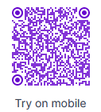

# Restaurant Priority
## Members: Matheus Freitas, Vitor Bandeira, Thomas Bekhor
YOLOv8 Object Detection model that recognizes tables from a upper view, such as from a security camera. The Dataset used was obtained in Roboflow and can be accessed [here](https://universe.roboflow.com/new-workspace-rshoj/luis/dataset/1). Although it has multiple classes, the model only aims to predict people/waiters and tables, with the goal of detecting waiting tables and warning staff which clients should be given higher priority.

## Training
The Dataset containts almost 1,500 annotated images. Firstly, there was an attempt to use Yolo-Keras-V3 & Google Collab to train the model, however, training was too time-consuming and the results were not satisfactory. Therefore, there was a migration to YOLOv7 training which proved much more effective. The images were pre-processed so that their size were uniform (640x640px) and auto-orientation was applied. Here are the following results to mAP and losses:

<br />
<p align="center">
  
</p>

<p align="center">
  
</p>
<br />

## Model Results with different Images
It was noted that the model had a better performance when the images for detection displayed the restaurant in a more vertical manner. The lower the camera was located, the lower the performance of the model was. To exemplify, here is a internet picture of a restaurant where the model was able to detect to some extent people and tables:

<br />
<p align="center">
  
</p>
<br />

The group tested with real world images from *Lanchonete Quatá (Marromzinho)* and *Restaurante Filó*, and the behvaiour explained previsouly could be observed: ideally, camera should be positioned higher so that there is a better recognition:
- Better Performance (Marromzinho):
  
<br />
<p align="center">
  
</p>
<br />

- Poor performance (Marromzinho & Filó):
  
<br />
<p align="center">
  
  
</p>
<br />

## Deploy

- The model is available for testing in the [following URL](https://detect.roboflow.com/?model=restaurant-tables-ymr9k&version=4&api_key=4DoXpwcq4LOWCz9iZkq0), where you can upload your own picture and test its recognition.
- It can also be tested in your own mobile device by scanning the follow QR code:

<br />
<p align="center">
  
</p>
<br />

## Next Steps

As future iterations, the development of a logic using the detection bounding boxes can be cited. In other words, using the bounding boxes of people/waiter and table, an application could detect automatically that a table has people waiting for their food, and trigger a chronometer which would monitor how long is the waiting time. A pseudocode of such idea is listed below:

```python
while !table_Waiting_time:
  if bounding_box_people and bounding_box_table overlap > threshold:
    waiting_time = time_now()
    table_waiting_time = true

if waiter_input:
  total_waiting_time = time_now() - waiting_time
```

Once the food is served, the waiting time should be over, and this could be achieved manually via a waiter input on the application, or the model could be iterated to detect empty or full dishes. However, the latter option could be difficult to be implemented due to known very low resolution on restaurant cameras.

## Use case
This model not only could be used to detect which tables should be given priority, but also to monitor which dishes take longer to make, which tables are often overlooked by waiters, constructing a pipeline of continuous improvement for a restaurant.
